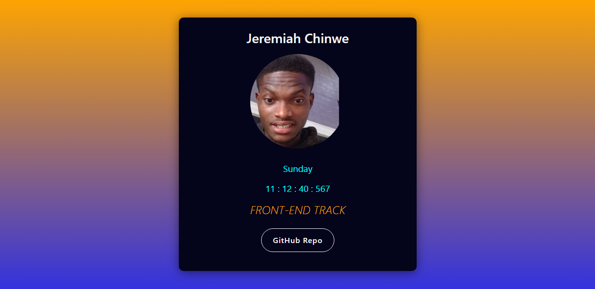

# HNG Internship - Frontend Page Creation With Specific Elements

This is the Solution to the Stage One Project On HNG Internship Program

## Overview

This is my first project/challenge at HGN Intership and it's 

### Links

### Screenshot

- Live Site URL: [Vercel](https://stage-one-project.vercel.app/)

## My process

I approached the project by building the HTML Markup first with Semantic Html then before styling.

### Built with

- Semantic HTML5 markup
- Flexbox
- Mobile-first workflow

## Author

- Twitter - [@jeremiahchinwe](https://www.twitter.com/jeremiahchinwe)

